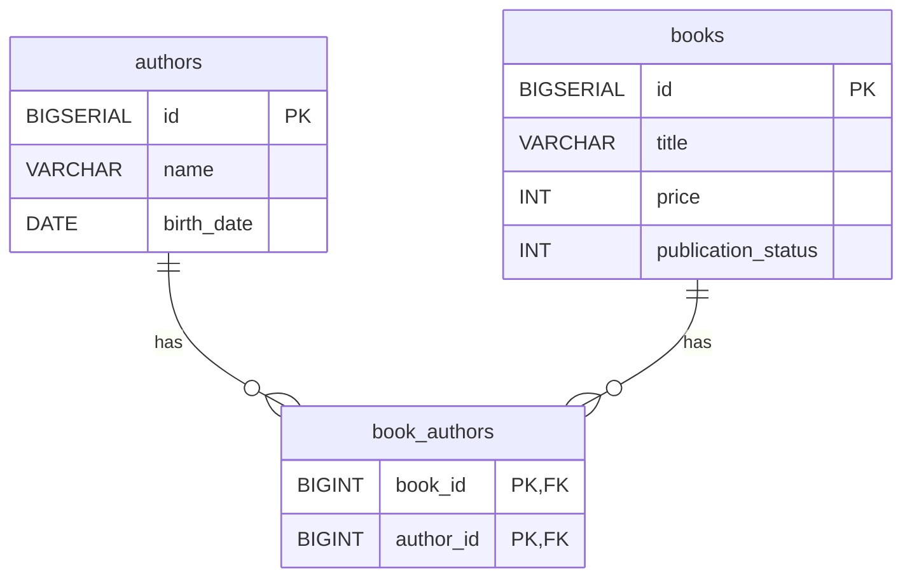

## 前提条件

- WSLのUbuntu上にリソースの配置、必要機能（Git,DockerEngine,JDK等）をインストール済

## プロジェクト起動手順

1. 本プロジェクトのclone
1. 下記コマンドにてpostgresqlコンテナの起動
    1. `cd docker`
    1. ` docker-compose up -d`
    1. ` docker-compose run --rm flyway-migrate`
1. 下記操作にてSpring Bootアプリケーションの起動
    1. IntelijにてGradleの「Sync All Gradle Project」を押下
    1. `./gradlew bootRun`（プロジェクトルートディレクトリにて）
1. 任意のAPIリクエスト実施可能

## API仕様書

### 前提条件

- 共通
    - 各API呼び出し時のホストは下記を指定
        - http://localhost:8080
    - 著者、書籍の各項目には必ず値が登録される
    - 著者、書籍について、各項目が全て重複するデータは登録しない
    - 更新系APIについて、リクエストボディに項目を含まない、またはnull、空文字をセットした場合、その項目に対する更新処理は実施しない
- 著者
    - 生年月日は現在日を含まない過去日のみ登録可
    - 著者は複数の書籍を執筆している
- 書籍
    - 書籍の価格は正の数である
    - 最低1人の著者に紐づく
    - 出版状況について、出版済みから未出版への更新は不可

### 著者情報検索API

- 概要
    - 著者の情報と著作の一覧を取得する
- HTTPメソッド
    - GET
- APIパス
    - /api/authors/{著者ID}/books
- パラメータ
    - 情報を取得したい著者のID
- リクエストボディ
    - なし
- リクエスト例

```
curl http://localhost:8080/api/authors/1/books
```

- レスポンス例（成功）

```json
{
  "author": {
    "id": 1,
    "name": "John",
    "birthDate": "1980-05-15"
  },
  "books": [
    {
      "id": 1,
      "title": "SQL入門",
      "price": 2981,
      "
      publicationStatus
      " : 1
    },
    {
      "id": 4,
      "title": "Web開発のすべて",
      "price": 1999,
      "publicationStatus": 1
    }
  ]
}
```

- レスポンス例（失敗：指定した著者IDが存在しない場合）

```json
{
  "status": 404,
  "message": "指定された著者が見つかりません。",
  "details": "uri=/api/authors/7/books",
  "errors": null
}
```

### 著者情報登録API

- 概要
    - 新規の著者情報を登録する
- HTTPメソッド
    - POST
- APIパス
    - /api/authors
- パラメータ
    - なし
- リクエストボディ
    - name（必須）：著者名
    - birthDate（必須）：著者生年月日
- リクエスト例

```
curl -X POST http://localhost:8080/api/authors \
-H "Content-Type: application/json" \
-d '{
    "name": "山田太郎",
    "birthDate": "2025-08-03"
}'
```

- レスポンス例（成功）

```json
{
  "id": 6,
  "name": "山田太郎",
  "birthDate": "2025-08-03"
}
```

- レスポンス例（失敗：必須項目に値を入れない場合、生年月日に未来の日付をセットした場合）

```json
{
  "status": 400,
  "message": "入力データに誤りがあります。",
  "details": "uri=/api/authors",
  "errors": [
    "name: 必須項目です。",
    "birthDate: birthDateは過去の日付である必要があります。"
  ]
}
```

### 著者情報更新API

- 概要
    - 登録済みの著者情報を更新する
- HTTPメソッド
    - PATCH
- APIパス
    - /api/authors/{著者ID}
- パラメータ
    - 情報を更新したい著者のID
- リクエストボディ
    - name：著者名
    - birthDate：著者生年月日
- リクエスト例

```
curl -X PATCH http://localhost:8080/api/authors/6 \
-H "Content-Type: application/json" \
-d '{
    "name": "山田三郎"
}'
```

- レスポンス例（成功）

```json
{
  "id": 6,
  "name": "山田三郎",
  "birthDate": "2025-08-03"
}
```

- レスポンス例（失敗:リクエストボディが空の場合）

```json
{
  "status": 400,
  "message": "更新する項目がありません。",
  "details": "uri=/api/authors/6",
  "errors": null
}
```

### 書籍情報登録API

- 概要
    - 新規の書籍情報を登録する
- HTTPメソッド
    - POST
- APIパス
    - /api/books
- パラメータ
    - なし
- リクエストボディ
    - title（必須）：書籍タイトル
    - price（必須）：価格
    - publicationStatus（必須）：出版状況（0：未出版、1：出版済）
    - authorIds（必須）：著者ID（複数指定可）
- リクエスト例

```
curl -X POST http://localhost:8080/api/books \
-H "Content-Type: application/json" \
-d '{
    "title": "とても暑い日の本",
    "price": 2500,
    "publicationStatus": 0,
    "authorIds": [1, 2]
}'
```

- レスポンス例（成功）

```json
{
  "id": 6,
  "title": "とても暑い日の本",
  "price": 2500,
  "publicationStatus": 0,
  "authorIds": [
    1,
    2
  ]
}
```

- レスポンス例（失敗：必須項目に不足がある場合）

```json
{
  "status": 400,
  "message": "入力データに誤りがあります。",
  "details": "uri=/api/books",
  "errors": [
    "title: タイトルは必須項目です",
    "price: 価格は必須項目です"
  ]
}
```

### 書籍情報更新API

- 概要
    - 登録済みの書籍情報を更新する
- HTTPメソッド
    - PATCH
- APIパス
    - /api/books/{id}
- パラメータ
    - 情報を更新したい書籍のID
- リクエストボディ
    - title：書籍タイトル
    - price：価格
    - publicationStatus：出版状況（0：未出版、1：出版済）
    - authorIds：著者ID（複数指定可）
- リクエスト例

```
curl -X PATCH http://localhost:8080/api/books/1 \
-H "Content-Type: application/json" \
-d '{
    "title": "更新された書籍タイトル",
    "price": 3000
}'
```

- レスポンス例（成功）

```json
{
  "id": 1,
  "title": "更新された書籍タイトル",
  "price": 3000,
  "publicationStatus": 1,
  "authorIds": [
    1,
    2
  ]
}
```

- レスポンス例（失敗）

```json
{
  "status": 400,
  "message": "出版済から未出版への変更はできません。",
  "details": "uri=/api/books/1",
  "errors": null
}
```

## ER図



## コマンド集（備忘用）

- リモートでバック実行時の起動コマンド
    - `./gradlew bootRun --debug-jvm`
- ktlint
    - コードスタイルチェック
        - `./gradlew ktlintCheck`
    - コード自動フォーマット
        - `./gradlew ktlintFormat`